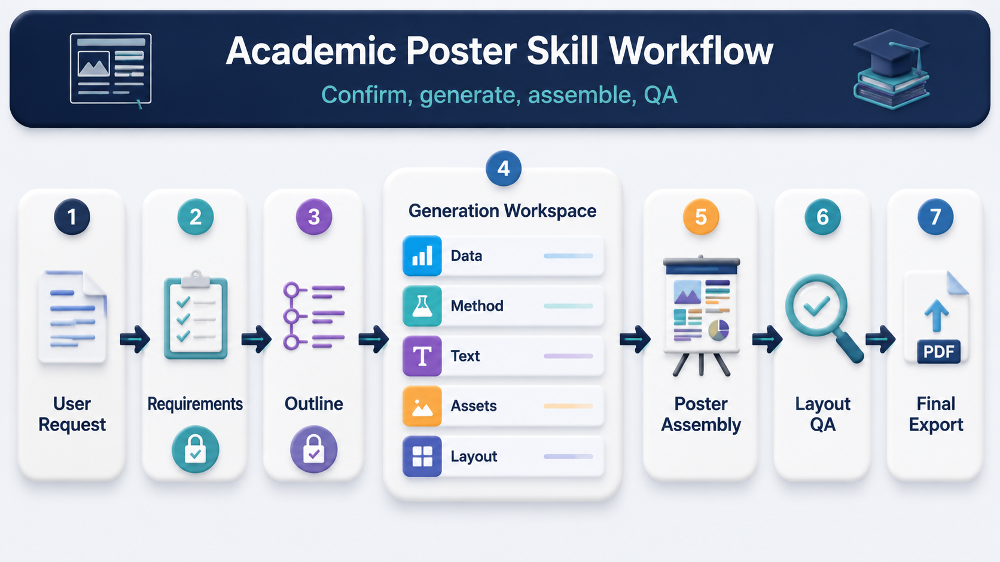

# Academic Poster Skill

Create polished academic posters from your research outline, data, figures, author information, logos, and export requirements. The skill supports English and Chinese posters, and can produce LaTeX/PDF or PPT/PPTX-style outputs depending on the project setup.

By default, it uses a modern card-based poster style with a strong title banner, clear content sections, visual panels, data figures, and a filled footer for references, contact details, or QR codes.

## How To Use

Ask Codex to create an academic poster, then provide the key information:

- Poster size, orientation, language, and desired output format.
- Title, authors, affiliations, and contact information.
- Research background, method, workflow, results, conclusions, and references.
- Data files, existing figures, logos, QR codes, or visual examples.
- Any required style, color, template, conference, or institution constraints.

Example:

```text
Use the academic-poster skill to create a Chinese A0 portrait poster.
I will provide the title, author list, experiment outline, result data, and logo files.
Please first confirm the requirements, then draft the poster content before generating the final poster.
```

## Workflow



1. **User Inputs**  
   Provide research content, data, author details, logos, and output requirements.

2. **Engineering Gate**  
   Confirm practical setup: size, format, language, tools, project folder, and export target.

3. **Content Gate**  
   Confirm the actual poster story: title, sections, workflow, figures, results, and references.

4. **Template Selection**  
   Use the default card-based poster style unless another layout is requested.

5. **Data Figures**  
   Build accurate charts, tables, and result visuals from the provided data.

6. **AI Visuals**  
   Create or adapt conceptual diagrams, workflow visuals, or schematic illustrations when helpful.

7. **Poster Assembly**  
   Place text, figures, diagrams, logos, QR codes, and footer content into the final layout.

8. **Layout QA & Export**  
   Check readability, spacing, overflow, visual balance, and export the final poster files.

## Best Results

- Keep the poster content concise and focused on the main scientific story.
- Provide real data for charts and quantitative results.
- Provide official logos and QR codes separately instead of asking AI to recreate them.
- Review the confirmed outline before final poster generation.
- Mention any strict conference, school, or lab formatting rules at the start.
